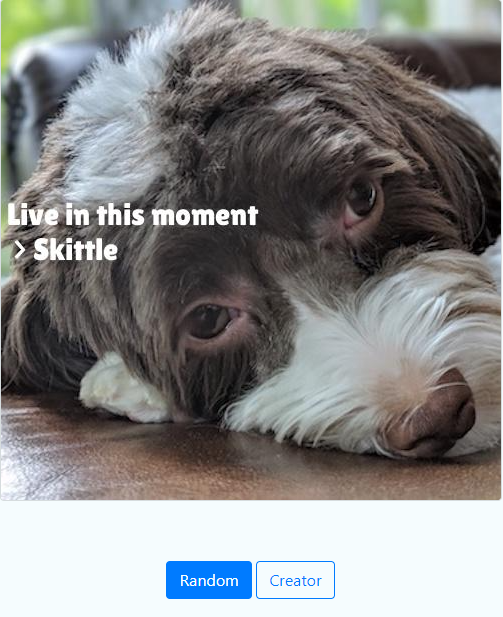
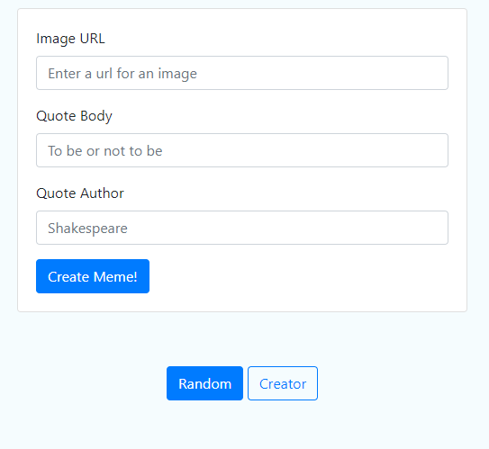

# Meme Genertor

This is one of the Udacity Intermediate Python Nanodegree project that generates a memes by inserting a quote along with its author name on an image. Images, quotes, and authors could be given or just randomly generated using the available images, quotes, and authors in this project `_data` folder.

## 1. Used Packages

Packages are found in the `requirements.txt` file. But mainly the used packages are: `python3`, `Flask`, `numpy`, `pandas`, `Pillow`, `python-docx`, `requests`, and `urllib3`. So if you just installed these packages, I think your package manager will mostly hander the other packages in the `requirements.txt` file since some of them are dependencies of the packages I have just mentioned.

## 2. Project Overview

This project mainly consists of two modules `MemeEngine`, and `QuoteEngine` modules.

### 2.1 `QuoteEngine` Module

This module is responsisble for parsing different supported file extensions according to the file type automatically to extract quotes, and authors for them. These files are the built-in files from which random quotes, and authors are extraced randomly if the user doesn't provide the quote and the author.

This module is built on a basic abstract class the `IngestorInterface` from which other classes inherit so that each new subclass is responsible for ingesting a different file type. The `strategy object` pattern is used in developing this application so that if we want to change some file type, add, or remove it, we could do it easily without having to change many parts in the code, and the code will still be consistent, organized, scalable, and maintainable.

### 2.2 `MemeEngine` Module

This module is responsible for writing quotes, and authors on images. It adjusts the font, and text alignment of the written texst. In addition to this, it write the quotes, and authors on random positions on the images.

### 2.3 What the User Can Do

The user can either choose to generate the quotes, and authors randomly on random images all of which are found in the `_data` folder in this project, or he could choose to:
1. Provide the `quote`, and the `author` and the images will be obtained randomly from the `_data` folder
2. Provide the `image`, and the `quote`, and the `author` will be obtained randomly from the `_data` folder
3. Provide the `image`, the `quote`, and the `author`

### 2.4 Folders' and Files' Descriptions

* **_data**: It contains the photos, the quotes along with their authors that are built in the tool
* **fonts**: It contains the font used to write text on the image
* **MemeEngine**: It contains the `MemeEngine` Module
* **QuoteEngine**: It contains the `QuoteEngine` Module
* **static**: It contains images generated on using the **Web Interface**
* **templates**: It contains the `.html` templates of the **Web Interface**
* **tmp**: It contains images generated on using the **Command Line Interface**
* **app.py**: The file containing the **Command Line Interface**
* **meme.py**: The file containing the **Web Interface**
* **requirements.txt**: The file containing the required packages for running this program

### 2.5 Suported Extensions in the `_data` Folder

* `*.txt`
* `*.csv`
* `*.docx`
* `*.pdf`


## 3. Running the program

This program has two interfaces. The **Command Line Interface**, and the **Web** interface.

To operate the program, you should first download the project, and install the packages found in teh `requirements.txt` file.

### 3.1 The Command Line Interface

Using your terminal either type `python3 meme.py` or type `python meme.py` to for the program to generate `quotes` along with their `authors`,, and `images` randomly. Or you could provide them by using the optional parameters. 

> **Note:** If you provided the `quote`, you must provide the `author` as well or the program will give you an error.

#### 3.3.1 optional parameters

* `--body` the quote body along with its author `--author`
* `--path` the input image path

#### 3.3.2 Examples of running the program

First in your terminal go to your project directory using `cd project_path` then
##### Random Generation
```
# randomly generate images, quotes along with their authors
>> python meme.py
# the output image path is returned
>> ./tmp/8851400.jpg
```
##### Random Image Generation while Specifying Quote and Author 
```
# randomly generate images while specifying quotes along with their authors
>> python meme.py --body="This is a quote example" --author="some_name"
# the output image path is returned
>> ./tmp/8851400.jpg
```
##### Specifying Image, Quote and Author 
```
# randomly generate images while specifying quotes along with their authors
>> python meme.py --path="some_image.jpg" --body="This is a quote example" --author="some_name"
# the output image path is returned
>> ./tmp/8851400.jpg
```

### 3.2 The Web Interface

First in your terminal go to your project directory using `cd project_path` then
```
# run the server
>> python app.py
# the output that you will git
>> * Serving Flask app 'app' (lazy loading)
   * Environment: production
     WARNING: This is a development server. Do not use it in a production deployment.
     Use a production WSGI server instead.
   * Debug mode: off
   * Running on http://address/ (Press CTRL+C to quit)
```
Then navigate to that address `http://address/` using your web browser and you will get something like this



1. You can then choose to generate images, quotes along with their authors randomly by pressing the `Random` button
2. You can also create a custome meme by pressing on `Creator` button then inserting the required inputs and then press `Creaete Meme!`

That is what you will get on pressing the `Creator` button.



